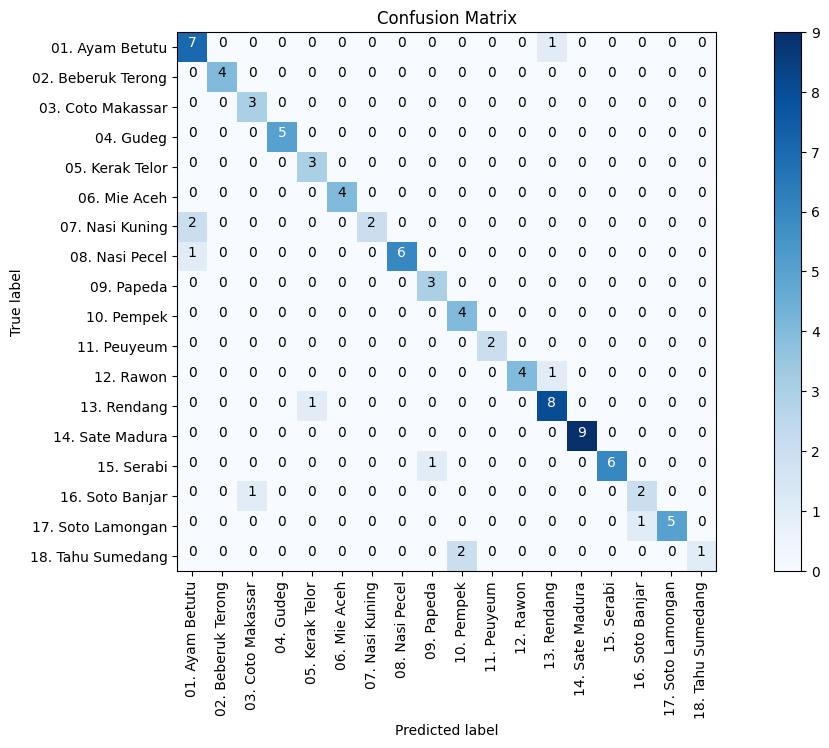
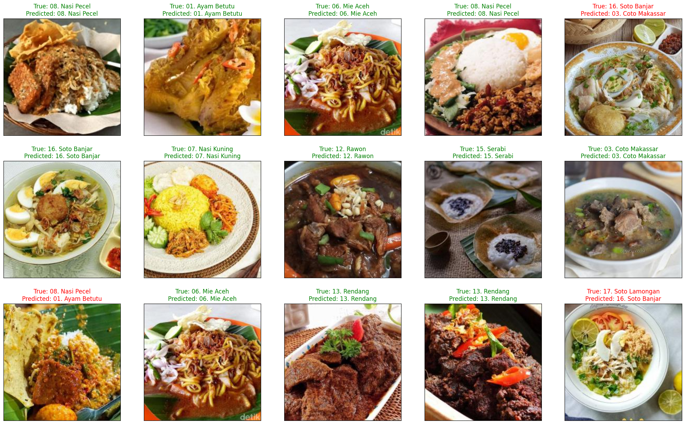

---

# Food Classification with Machine Learning

This repository contains the implementation of a machine learning project focused on the classification of different types of food. The project utilizes advanced machine learning techniques to accurately identify and classify various food items based on images.

## Project Structure

- `Train_model.ipynb`: This notebook contains the code for training the machine learning model. It includes data preprocessing, model architecture, training process, and evaluation metrics.
- `Testing_project.ipynb`: This notebook is used for testing the trained model on new images. It demonstrates the model's performance and provides visualizations of the classification results.

## Key Features

- **Data Preprocessing**: Techniques for cleaning and preparing the food image dataset for training.
- **Model Architecture**: Implementation of a convolutional neural network (CNN) for image classification.
- **Training Process**: Steps to train the model, including setting hyperparameters, optimizing the model, and monitoring performance.
- **Evaluation Metrics**: Methods to evaluate the model's accuracy and performance on test data.
- **Testing and Visualization**: Code to test the model on new images and visualize the results.

## Requirements

To run the notebooks, you need to have the following packages installed:

- Python 3.x
- TensorFlow or PyTorch (depending on the implementation)
- NumPy
- Pandas
- Matplotlib
- scikit-learn
- Jupyter Notebook

You can install the required packages using `pip`:

```bash
pip install tensorflow numpy pandas matplotlib scikit-learn jupyter
```

## Usage

1. Clone the repository:

```bash
git clone https://github.com/Rama0surya/Klasifikasi-Makanan-MobileNetV3.git
```

2. Open the notebooks in Jupyter:

```bash
jupyter notebook
```

3. Run the `Train_model.ipynb` notebook to train the model.
4. Use the `Testing_project.ipynb` notebook to test the model on new images and visualize the results.

## Results

The model is trained to classify various types of food with high accuracy. Below are some sample results:




